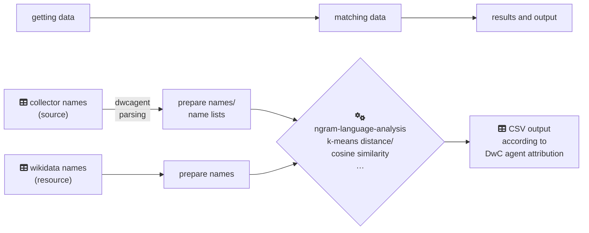

# Matching of Collector Names to Other Resources

Here we gathered tools to assist the name matching of (biological) collector names to other resources, like WikiData names and related IDs aso. This approach is based primarily on Niels Klazenga’s work from the Virtual Herbarium of Australia (☞ <https://github.com/nielsklazenga/avh-collectors/>), thank you for that ;-)

*What you need first:*

- You need to know programming or at least code programming understanding to use these tools. 
- If you have Jupyter Notebook and Python installed on your machine you can use or adapt the Notebook scripts to your needs more easily.
- One should have the GEM package dwcagent installed: To simplify and standardise name lists (i.e. multiple single names in a single line) into single names (☞ <https://libraries.io/rubygems/dwc_agent>).

Steps in general:

1. Getting Data (source names)
    
    - construct or prepare collector name data
    - parse names with dwcagent, i.e. standardization of given verbatim name lists into individual names

2. Getting Data (resource names)

    - get name lists with public person identifiers from WikiData (also other SPARQL resources would do)
    
3. Matching of Names

    - do matching and comparison of fragmentated name parts (n-grams) using k-nearest neighbour or cosine similarity
    - write table data output (e.g. CSV) according to DarwinCore Agent Attribution (GitHub: [RDA_recommendations.md](https://github.com/tdwg/attribution/blob/master/documents/RDA_recommendations.md), [RDA_technical_examples.md](https://github.com/tdwg/attribution/blob/master/documents/RDA_technical_examples.md)) to faciliate post processing
    

As a visual summary, the processing goes like:

There are 2 approaches to calculate name similarities, distances for this code, these have been labelled with tags:
  
- `vX.X-match-family-last` name matching has “given + particle … family, suffix“, newer calculation approach, e.g. [v0.1-match-family-last](https://github.com/infinite-dao/collector-matching/tree/v0.1-match-family-last) (of 2023-11-20, commit 0394c6…)
- `vX.X-match-family-first` name matching has “family, given + particle …”, old calculation approach (won’t continue), e.g. [v1.0-match-family-first](https://github.com/infinite-dao/collector-matching/tree/v1.0-match-family-first) (of 2023-11-16, commit 47178e…)

## Getting Data

Get *resource* names of WikiData to compare collector *source* names with:

- [`create_wikidata_datasets_botanists.ipynb`](./create_wikidata_datasets_botanists.ipynb)—to get data of botanists from WikiData

---

Get or construct *source* names, i.e. collector name lists—see the following examples.

BGBM example:
- [`create_bgbm_gbif-occurrence_collectors_dataset.ipynb`](./create_bgbm_gbif-occurrence_collectors_dataset.ipynb)—create an example data set from GIBF (*Virtual Herbarium Germany* (BGBM) <https://doi.org/10.15468/dl.tued2e>)
- [`create_bgbm_gbif-occurrence_collectors_eventDate_dataset.ipynb`](./create_bgbm_gbif-occurrence_collectors_eventDate_dataset.ipynb)—create an example data set with collection date (`eventDate`) from GIBF (*Virtual Herbarium Germany* (BGBM) <https://doi.org/10.15468/dl.tued2e>)

Meise example:
- [`create_meise_gbif-occurrence_collectors_eventDate_dataset.ipynb`](./create_meise_gbif-occurrence_collectors_eventDate_dataset.ipynb)—create an example data set with collection date (`eventDate`) from GIBF (*Meise Botanic Garden Herbarium* <https://doi.org/10.15468/dl.ax9zkh>)

Naturalis example:
- [`create_naturalis_gbif-occurrence_collectors_eventDate_dataset.ipynb`](./create_naturalis_gbif-occurrence_collectors_eventDate_dataset.ipynb)—create an example data set with collection date (`eventDate`) from GIBF (*Naturalis Biodiversity Center (NL) - Botany* <https://doi.org/10.15468/dl.uw8rxk>)

Plazi example:
- [`create_plazi_collectors_dataset.ipynb`](./create_plazi_collectors_dataset.ipynb)—create only data from Plazi‘s Collection Statistics “Materials Citation Data” (<https://tb.plazi.org/GgServer/srsStats>)

## Parsing of Name Lists

See ☞ [`bin/README.md`](./bin/README.md).

## Matching of Names

BGBM examples matching also life time and `eventDate` (sampling date)

- [`match_names_BGBM-dwcagent-parsed-eventDate_vs_WikiData_k-nearest.ipynb`](./match_names_BGBM-dwcagent-parsed-eventDate_vs_WikiData_k-nearest.ipynb)—using k-nearest neighbour distance of parsed collector names, including eventDate (=date of sampling event)
- [`match_names_BGBM-dwcagent-parsed-eventDate_vs_WikiData_cosine-similarity.ipynb`](./match_names_BGBM-dwcagent-parsed-eventDate_vs_WikiData_cosine-similarity.ipynb)—using cosine-similarity of parsed collector names, including eventDate (=date of sampling event)

BGBM examples _without_ `eventDate` (sampling date): result data removed, practically old code, it’s better to have some kind of sampling date/eventDate reference to match also the life time of a collector

Meise examples:

- [`match_names_Meise-dwcagent-parsed-eventDate_vs_WikiData_k-nearest.ipynb`](./match_names_Meise-dwcagent-parsed-eventDate_vs_WikiData_k-nearest.ipynb)—using k-nearest neighbour distance of parsed collector names, including eventDate (=date of sampling event)
- [`match_names_Meise-dwcagent-parsed-eventDate_vs_WikiData_cosine-similarity.ipynb`](./match_names_Meise-dwcagent-parsed-eventDate_vs_WikiData_cosine-similarity.ipynb)—using cosine-similarity of parsed collector names, including eventDate (=date of sampling event)

Naturalis examples:

- [`match_names_Naturalis-dwcagent-parsed-eventDate_vs_WikiData_k-nearest.ipynb`](./match_names_Naturalis-dwcagent-parsed-eventDate_vs_WikiData_k-nearest.ipynb)—using k-nearest neighbour distance of parsed collector names, including eventDate (=date of sampling event)
- [`match_names_Naturalis-dwcagent-parsed-eventDate_vs_WikiData_cosine-similarity.ipynb`](./match_names_Naturalis-dwcagent-parsed-eventDate_vs_WikiData_cosine-similarity.ipynb)—using cosine-similarity of parsed collector names, including eventDate (=date of sampling event)

Plazi example:

- [`create_and_match_plazi_collectors_dataset.ipynb`](./create_and_match_plazi_collectors_dataset.ipynb)—create and match data from Plazi‘s Collection Statistics “Materials Citation Data” (<https://tb.plazi.org/GgServer/srsStats>)

## TODO and Review

- review and improve the code:

    - compare name matching algorithm (<https://github.com/nielsklazenga/avh-collectors/cosine_similarity.ipynb> ⇌ `nearest_neighbour`)
    - improve name matching if own source data containing a full name, this can be matched against WikiData (perhaps parsed) `itemLabel`, which is mostly the full name, also fine tuning (k-neighbour: Number of neighbors required for each sample by default for :meth:`kneighbors` queries (originally 5).)

- review life time matching

    - matching including `eventDate` (i.e. sampling date in this case; read https://www.gbif.org/data-quality-requirements-occurrences#dcEventDate)
    - floruit time span of person
    - recorded date of museum sample if no life data of the person are available ?occurrence.txt → eventDate? (see https://www.gbif.org/developer/occurrence section “Query parameters explained”

- review scoring/rating
- review DarwinCore attribution output (e.g. provided columns)
