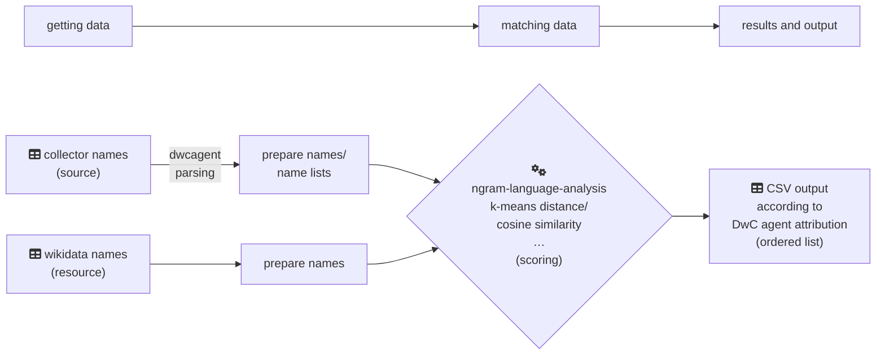

# Matching of Collector Names to Other Resources

Here we gathered tools to assist the name matching of (biological) collector names to other resources, like WikiData names and related IDs aso. This approach is based primarily on Niels Klazenga’s work from the Virtual Herbarium of Australia (☞ <https://github.com/nielsklazenga/avh-collectors/>), thank you for that ;-)

*What you need first:*

- You need to know programming or at least code programming understanding to use these tools.
- If you have Jupyter Notebook and Python installed on your machine you can use or adapt the Notebook scripts to your needs more easily.
- One should have the GEM package dwcagent installed: To simplify and standardise name lists (i.e. multiple single names in a single line) into single names (☞ <https://libraries.io/rubygems/dwc_agent>).

## Installation & Setup

To ensure a clean environment and avoid dependency conflicts, it is recommended to run this project within a virtual environment (`venv`).


1.  **Set up the virtual environment the first time:**
    This will remove any old environment, create a fresh one, and activate it.

    ```bash
    # remove venv, to make a clean new virtual environment directory
    [ -d venv ] && rm --recursive --force venv/
    python -m venv venv
    source venv/bin/activate # activate virtual environment
    ```

2.  **Install dependencies within `venv`:**
    Upgrade `pip` and install all required packages for the matching algorithm and Jupyter integration.

    ```bash
    pip install --upgrade pip
    ```
    If you develop you can install packages in general:
    ```bash
    pip install ipykernel sparqlwrapper pandas scikit-learn scipy sparse_dot_topn ftfy seaborn requests
    ```

    If you want to use just this configuration you install the set of packages of the `requirements.txt`-repo-version by:
    ```bash
    pip install -r requirements.txt
    ```


3.  **Register the Kernel and launch:**
    To use this environment inside Jupyter, you need to install it as a kernel. Afterward, you can start the notebook.

    ```bash
    # Register the installed environment as a Jupyter kernel
    python -m ipykernel install --user --name=botanist_project --display-name "Python (Botanist Name Matching)"

    # Start the notebook server
    jupyter notebook
    ```

4.  **Select Kernel:**
    Once the Jupyter interface opens, make sure to select **“Python (Botanist Name Matching)”** from the Kernel menu.

5. **Eventually — Exit the virtual `venv` setting:**
    ```bash
    # once you have finished working with the notebooks you can exit the venv by
    deactivate # get out of the venv from above
    ```

## Steps in general for Name Matching

1. Getting Data (source names)

    - construct or prepare collector name data
    - parse names with dwcagent, i.e. standardization of given verbatim name lists into individual names

2. Getting Data (resource names)

    - get name lists with public person identifiers from WikiData (also other SPARQL resources would do)

3. Matching of Names

    - do matching and comparison of fragmentated name parts (n-grams) using k-nearest neighbour or cosine similarity
    - write table data output (e.g. CSV) according to DarwinCore Agent Attribution (GitHub: [RDA_recommendations.md](https://github.com/tdwg/attribution/blob/master/documents/RDA_recommendations.md), [RDA_technical_examples.md](https://github.com/tdwg/attribution/blob/master/documents/RDA_technical_examples.md)) to faciliate post processing

4. Decide the associated linkages

    - These programmes only provide the basis for the decision, the decision as to which names are to be linked to which identifiers should not be made blindly and automatically, but a person (e.g. curator) should assess this and then decide ;-)

As a visual summary, the processing goes like:



Two approaches to calculating name similarities and distances were pursued for this code, which are labelled with tags:

- `vX.X-match-family-last` name matching has “given + particle … *family*, suffix“, newer calculation approach, e.g. [v0.1-match-family-last](https://github.com/infinite-dao/collector-matching/tree/v0.1-match-family-last) (of 2023-11-21)
- `vX.X-match-family-first` name matching has “*family*, given + particle …”, old calculation approach (won’t continue), e.g. [v1.0-match-family-first](https://github.com/infinite-dao/collector-matching/tree/v1.0-match-family-first) (of 2023-11-16, commit 47178e…)

## Getting Data

Get *resource* names of WikiData to compare collector *source* names with:

- [`create_wikidata_datasets_botanists-altlabel.ipynb`](./create_wikidata_datasets_botanists-altlabel.ipynb)—to get data of botanists from WikiData

---

Get or construct *source* names, i.e. collector name lists—see the following examples where we use, in most cases, the GIBF occurrence data of the institutions themselves:

| Institution | Remarks | Script(s) |
| --- | --- | --- |
| BGBM | plain name data | [`create_bgbm_gbif-occurrence_collectors_dataset.ipynb`](./create_bgbm_gbif-occurrence_collectors_dataset.ipynb) |
| BGBM | name data with collection date (`eventDate`) for life time comparison | [`create_bgbm_gbif-occurrence_collectors_eventDate_dataset.ipynb`](./create_bgbm_gbif-occurrence_collectors_eventDate_dataset.ipynb) |
| Meise | name data with collection date (`eventDate`) for life time comparison | [`create_meise_gbif-occurrence_collectors_eventDate_dataset.ipynb`](./create_meise_gbif-occurrence_collectors_eventDate_dataset.ipynb) |
| Naturalis | name data with collection date (`eventDate`) for life time comparison | [`create_naturalis_gbif-occurrence_collectors_eventDate_dataset.ipynb`](./create_naturalis_gbif-occurrence_collectors_eventDate_dataset.ipynb) |
| Plazi | Plazi‘s Collection Statistics “Materials Citation Data” | [`create_plazi_collectors_dataset.ipynb`](./create_plazi_collectors_dataset.ipynb)<br>[`create_and_match_plazi_collectors_dataset.ipynb`](./create_and_match_plazi_collectors_dataset.ipynb) |


## Parsing of Name Lists

See ☞ [`bin/README.md`](./bin/README.md).


## Matching of Names

| Institution | Remarks | Script(s) |
| --- | --- | --- |
| BGBM | cosine-similarity, with collection date (`eventDate`) for life time comparison | [`match_names_BGBM-dwcagent-parsed-eventDate_vs_WikiData_cosine-similarity.ipynb`](./match_names_BGBM-dwcagent-parsed-eventDate_vs_WikiData_cosine-similarity.ipynb) |
| BGBM | k-nearest neighbour distance, with collection date (`eventDate`) for life time comparison | [`match_names_BGBM-dwcagent-parsed-eventDate_vs_WikiData_k-nearest.ipynb`](./match_names_BGBM-dwcagent-parsed-eventDate_vs_WikiData_k-nearest.ipynb) |
| Meise | cosine-similarity, with collection date (`eventDate`) for life time comparison | [`match_names_Meise-dwcagent-parsed-eventDate_vs_WikiData_cosine-similarity.ipynb`](./match_names_Meise-dwcagent-parsed-eventDate_vs_WikiData_cosine-similarity.ipynb) |
| Meise | k-nearest neighbour distance, with collection date (`eventDate`) for life time comparison | [`match_names_Meise-dwcagent-parsed-eventDate_vs_WikiData_k-nearest.ipynb`](./match_names_Meise-dwcagent-parsed-eventDate_vs_WikiData_k-nearest.ipynb) |
| Naturalis | cosine-similarity, with collection date (`eventDate`) for life time comparison | [`match_names_Naturalis-dwcagent-parsed-eventDate_vs_WikiData_cosine-similarity.ipynb`](./match_names_Naturalis-dwcagent-parsed-eventDate_vs_WikiData_cosine-similarity.ipynb) |
| Naturalis | k-nearest neighbour distance, with collection date (`eventDate`) for life time comparison | [`match_names_Naturalis-dwcagent-parsed-eventDate_vs_WikiData_k-nearest.ipynb`](./match_names_Naturalis-dwcagent-parsed-eventDate_vs_WikiData_k-nearest.ipynb) |
| Plazi | k-nearest neighbour distance, with citation date for life time comparison | [`create_and_match_plazi_collectors_dataset.ipynb`](./create_and_match_plazi_collectors_dataset.ipynb) |

BGBM examples _without_ `eventDate` (sampling date): result data removed, practically old code, it’s better to have some kind of sampling date/eventDate reference to match also the life time of a collector


## TODO and Review

See [TODO.md](TODO.md)
