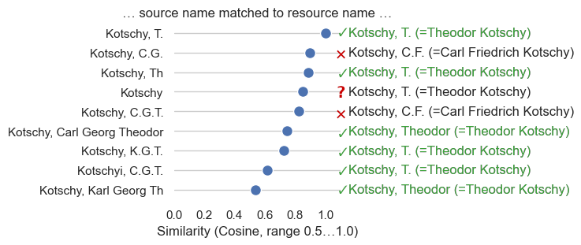

Validation
==========

Python approach
---------------

A calculated name distance of 0 or similarity equal to 1 can be evaluated as an exact match; in these cases of exact match, only the evaluation of possible different persons who have the same name remains. Automatic evaluation is more difficult if the match lies in intermediate ranges. Figure 1 shows a classic example with matches on two different resource names, in the intermediate ranges there are many real matches but also false ones.

   **Fig 1:** Comparison of the source collector name results using the example of Kotschy—there are 2 available names: Karl Georg Theodor Kotschy (=Theodor Kotschy (1813-1866), `Q113299`_) and Carl Friedrich Kotschy (1789-1856), `Q86842`_); a name distance of 0 or a similarity of 1 is an exact match; green ✓ are true matches, red ✕ are false ones, red ? is ambiguous.

.. _Q113299: http://www.wikidata.org/wiki/Q113299
.. _Q86842: http://www.wikidata.org/wiki/Q86842

At present, the evaluation is still manual, but additional properties can be added to improve the accuracy of the matches, e.g. the lifetime data in combination with the collection date. It would also be conceivable to additionally evaluate alias names from Wikidata: the aim here would be to find only a 100 % match within the alias names, which would increase or confirm the certainty of finding the possibly correct name.
